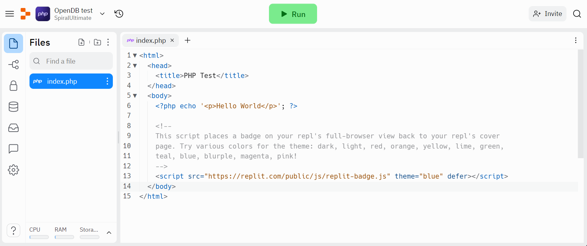
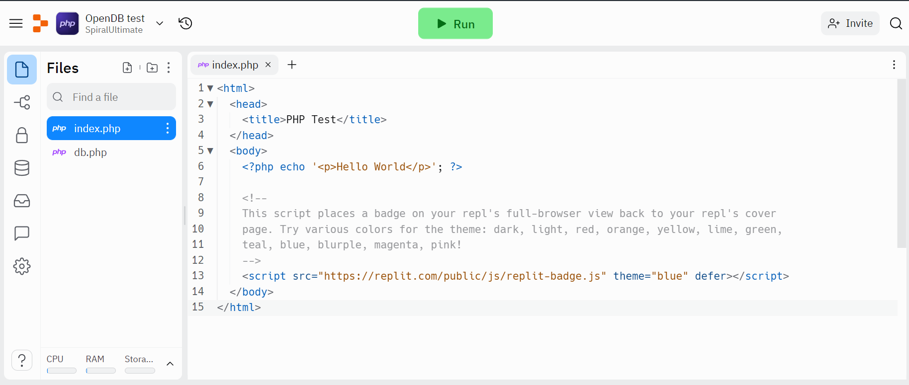
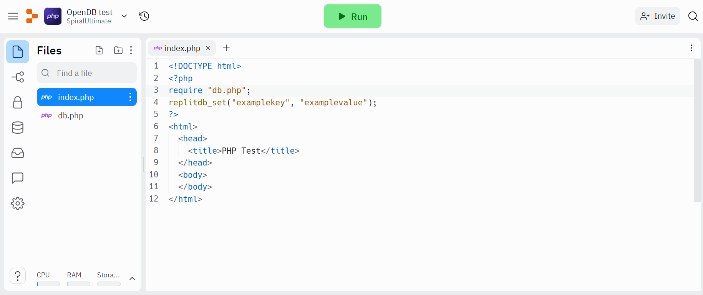

# how to import OpenDB
If you are here you are probably wondering how to import OpenDB  
to import OpenDB just creator or open your replit php project. if you just created your project it should look something like this  

Now just drag and drop the file from your destop so it looks something like this

Finally import and use it in your code

